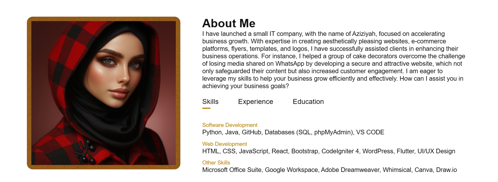
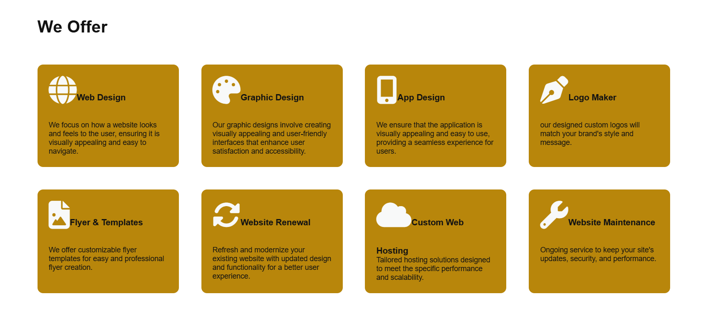
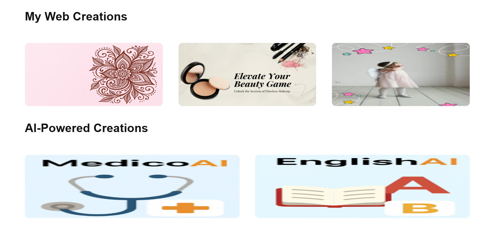

# Personal Portfolio — Sumayyah Aziz Ahmed
A clean, modern, and thoughtfully crafted portfolio showcasing my work as a Full‑Stack Developer, Creative Technologist, and Founder of Aziziyah. Designed to highlight my projects, skills, and design philosophy with clarity and elegance.

## What’s Inside
- **Featured Projects** — Real client work, AI tools, and creative builds

- **Skills & Tech Stack** — Full‑stack development, UI/UX, and modern frameworks

- **About Me** — My journey, values, and approach to building meaningful digital experiences

- **Contact Section** — Easy ways to reach me for collaborations or freelance work

## Tech Used
* HTML, CSS, JavaScript

* Responsive UI Design

* Git & GitHub

* VS Code

## Live Portfolio
Explore the site: **[https://sumayyah-ahmed.github.io/Portfolio/](https://sumayyah-ahmed.github.io/Portfolio/)**

## 📸 Screenshots 
  
   
 

# Enjoyed This Project?
If you find this project helpful or inspiring, please consider giving it a ⭐. It really motivates me to keep building. Thanks!
